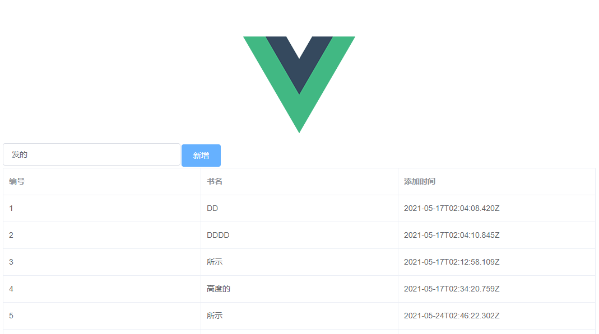

# Django + vue + mysql 实现书籍列表添加

- 本篇实战示例，使用Vue.js作为前端框架，代替Django本身自带的模板引擎，Django则作为服务端提供API接口，从而实现前后端分离。


- 参考：[Python 3+Django 3 结合Vue.js框架构建前后端分离Web开发平台实战
](https://blog.csdn.net/lantian_123/article/details/103750347)

## 文件目录
```buildoutcfg
.
├── django_vue
│   ├── django_vue      # django 设置
│   │   ├── settings.py     # django 的一些设置如：数据库、静态网页地址等
│   │   └── urls.py         # django 添加新APP的路由
│   │    
│   ├── api_test        # App 项目主目录
│   │   ├── models.py       # 简单的models,供views调用
│   │   ├── views.py        # 功能函数：新增两个功能函数
│   │   └── urls.py         # 新增的两个接口添加到路由里
│   │
│   └── frontend        # vue 前端
│       ├── src             # vue 源文件
|       │   ├── components              # vue 组件：主要写vue页面
│       │   │   ├── HelloWorld.vue          # vue 页面
│       │   │   └── Home.vue                # 我们的book功能vue页面
│       │   │   
|       │   ├── router                  # vue 路由
│       │   │   └── index.js                # vue 路由页面
│       │   │   
│       │   ├── App.vue                 # vue 主页面
│       │   └── main.js                 # vue 入口：导入element-ui、vue-resource库。
│       │   
│       ├── dist             # webpack 打包文件
|       │   ├── static                  # 静态文件
|       │   └── index.html              # 入口
|       |   
│       └── manage.py        # vue 配置管理文件
│     
├── venv          # python 虚拟环境
│   ├── Include                  
│   ├── Lib                 
│   └── Scripts   # python.exe 所在位置            
│      
└── README.md

```
## 配置环境
```buildoutcfg
Python 3.7.4

Mysql 5.7

Pycharm 

Node
```

```buildoutcfg
python3 -m venv venv
activate django_env
pip install django
```
## 运行
```buildoutcfg
(venv) ➜ python manage.py runserver
```